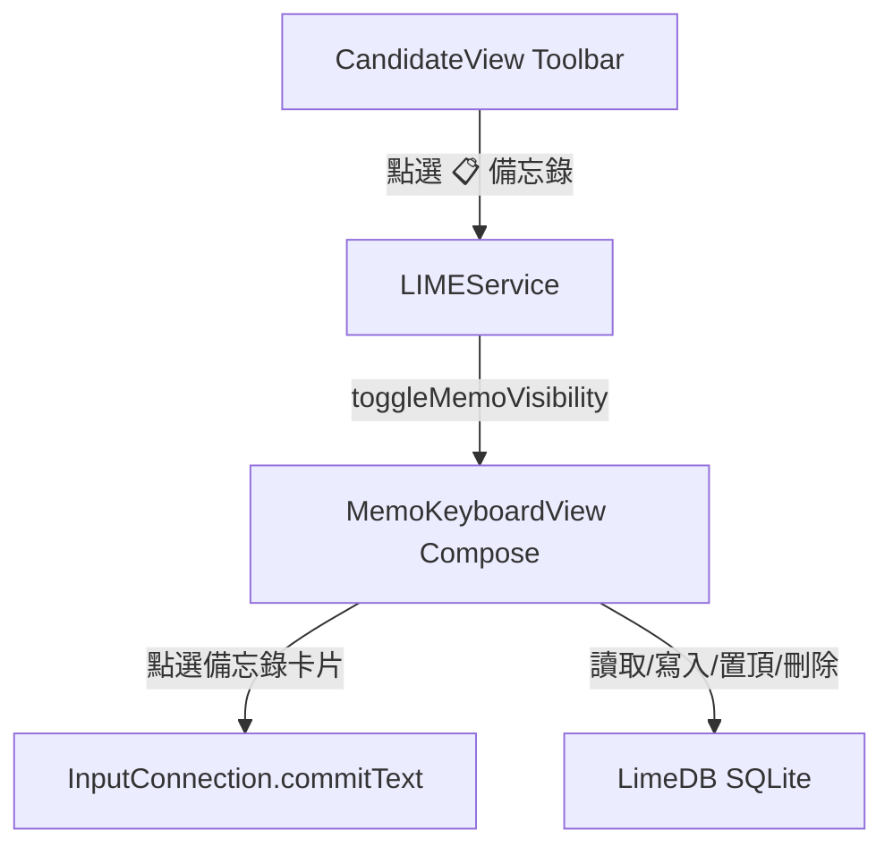

# WFIME「備忘錄（Memo）」功能與極簡工具列實作計畫

本計畫旨在為 WFIME 鍵盤進行兩大優化：
1. **極簡化工具列**：將主工具列功能縮減為核心的三大旗艦按鈕：**「備忘錄 📋」**、**「表情符號 😃」** 與 **「設定 ⚙️」**，大幅降低視覺干擾並提升操作效率。
2. **整合式備忘錄面板 (Memo Panel)**：於鍵盤區域內置一套 Gboard 風格的「常用備忘錄」控制台。使用者可儲存常用短語、通訊地址或範本，點選即可一鍵上字，並支援快速儲存剪貼簿、置頂（Pin）、刪除與手動編輯，採用 SQLite 資料庫進行持久化儲存。

---

## 📸 視覺設計與 UI/UX 規劃

### 1. 極簡工具列 (Simplified Toolbar)
當鍵盤無中文組字、無候選字且無編譯字根時，頂部工具列將以極致的現代感呈現，僅保留三個精緻圓形按鈕：
* **備忘錄** (`Icons.Default.Assignment`)：觸發開啟/關閉內置備忘錄面板。
* **表情符號** (`Icons.Default.Mood`)：觸發開啟/關閉 emoji 選擇器。
* **設定** (`Icons.Default.Settings`)：啟動麥田輸入法主控台設定 Activity。

### 2. 備忘錄控制面板 (Memo Panel UI)
當點選「備忘錄」按鈕時，主鍵盤與選字列自動隱藏，原區域被**高雅的 Compose 備忘錄面板**替換（高度與原鍵盤區域完全一致，約 300.dp，維持完美的視覺安定感）：

* **頂部標題列 (Header Bar)**：
  - **返回按鈕** (`Icons.Default.ArrowBack`)：點選後關閉備忘錄面板，恢復一般虛擬鍵盤。
  - **面板標題**：`"常用備忘錄"`，使用 HSL 暗色調中性白，配合 premium 字體。
  - **右側快捷按鈕**：
    - **「從剪貼簿新增 ＋」膠囊按鈕**：一鍵讀取系統剪貼簿文字，直接存入備忘錄資料庫，極為高效！
    - **「手動新增」圖示**：彈出輕量級手動輸入編輯框。
* **滾動式備忘錄卡片列表 (Memo List)**：
  - 採用 Compose `LazyColumn` 呈現，底色為高級暗灰色 (`#2E2E2E`)。
  - 每個備忘錄以**圓角卡片 (Card)** 封裝，顯示前 3 行文字預覽。
  - 卡片右側提供快捷動作：
    - **置頂圖示** (`Icons.Default.PushPin`)：點選可將備忘錄置頂（Pinned）。置頂備忘錄會自動鎖定在列表最上方，並顯示明亮霓虹綠。
    - **刪除圖示** (`Icons.Default.Delete`)：點選可一鍵刪除該備忘錄。
  - **一鍵貼上**：點擊卡片任何文字區域，**立刻將該備忘錄完整文字送入目前應用程式編輯框**，且面板保持開啟，方便使用者連續點選貼上！

---

## 🧱 系統架構與 Proposed Changes



### 1. 資料庫持久層 (Database Layer)

#### [MODIFY] [LimeDB.java](file:///c:/Storage/workspace/nanime-main/LimeStudio/app/src/main/java/net/toload/main/hd/limedb/LimeDB.java)
- **定義新資料表常量**：
  ```java
  public static final String DB_MEMO = "memo";
  public static final String DB_MEMO_COLUMN_ID = "_id";
  public static final String DB_MEMO_COLUMN_CONTENT = "content";
  public static final String DB_MEMO_COLUMN_PINNED = "pinned";
  public static final String DB_MEMO_COLUMN_CREATED_AT = "created_at";
  ```
- **在資料庫初始化時新增建表語句**（或在資料庫版本升級時動態新增）：
  ```sql
  CREATE TABLE memo (
      _id INTEGER PRIMARY KEY AUTOINCREMENT,
      content TEXT NOT NULL,
      pinned INTEGER DEFAULT 0,
      created_at INTEGER
  );
  ```
- **新增資料庫 CRUD 介面**：
  - `public long insertMemo(String content, int pinned)`
  - `public List<MemoObj> getMemos()`：依照 `pinned DESC, created_at DESC` 進行排序，確保置頂卡片始終在最上方。
  - `public int deleteMemo(int id)`
  - `public int updateMemoPin(int id, int pinned)`
  - `public int updateMemoContent(int id, String content)`

#### [NEW] [MemoObj.java](file:///c:/Storage/workspace/nanime-main/LimeStudio/app/src/main/java/net/toload/main/hd/limedb/MemoObj.java)
- 用於承載備忘錄資料的 Java Model 物件，包含 `id`、`content`、`pinned`、`createdAt` 的 getter/setter。

---

### 2. 視圖橋接層 (Compose View Bridge)

#### [MODIFY] [ComposeBridge.kt](file:///c:/Storage/workspace/nanime-main/LimeStudio/app/src/main/java/net/toload/main/hd/ComposeBridge.kt)
- **新增 `createMemoPanelView(context: Context, service: LIMEService): View?`**：
  - 仿照 `createEmojiPickerView` 模式，使用相同的 `Recomposer` 與 `ComposeLifecycleOwner` 管理生命週期。
  - 回傳包裝在具有 WindowInsets 監聽 FrameLayout 中的 Compose `MemoPanel` 視圖，確保平板與手機端完美避開系統導覽列。

#### [NEW] [MemoPanel.kt](file:///c:/Storage/workspace/nanime-main/LimeStudio/app/src/main/java/net/toload/main/hd/ui/MemoPanel.kt)
- **撰寫 Compose UI 介面**：
  - 訂閱 `memos` 響應式列表。
  - 繪製頂部標題列、剪貼簿一鍵新增按鈕。
  - 繪製備忘錄卡片列表，串接 `onMemoClick` 點擊動作、`onPinClick` 置頂動作、以及 `onDeleteClick` 刪除動作。

---

### 3. 輸入法核心引擎 (IME Service Core)

#### [MODIFY] [LIMEService.java](file:///c:/Storage/workspace/nanime-main/LimeStudio/app/src/main/java/net/toload/main/hd/LIMEService.java)
- **新增成員變數**：
  ```java
  public android.view.View mMemoKeyboardView = null; // 備忘錄 Compose 視圖
  ```
- **新增開關控制方法**：
  - `public void toggleMemoVisibility()`：
    - 若備忘錄面板為顯示狀態：隱藏面板，並依據硬體狀態重新開啟實體/虛擬鍵盤，重新載入選字列。
    - 若備忘錄面板為隱藏狀態：
      - 隱藏實體/虛擬鍵盤、候選字列與表情符號面板。
      - 惰性載入 `mMemoKeyboardView` 並將其加載至 `mInputViewContainer` 頂層顯示。
  - `public void closeMemoPanel()`：安全關閉備忘錄，回歸鍵盤。

---

### 4. 工具列簡化與事件串接 (Toolbar Integration)

#### [MODIFY] [CandidateView.kt](file:///c:/Storage/workspace/nanime-main/LimeStudio/app/src/main/java/net/toload/main/hd/candidate/CandidateView.kt)
- **簡化 `ToolbarRow()`**：
  - 移除「一鍵貼上（智慧剪貼簿）」、「即時翻譯（Google Translate）」等按鈕。
  - 僅放置三大旗艦按鈕：
    1. **備忘錄**：調用 `mService?.toggleMemoVisibility()`。
    2. **表情符號**：調用 `mService?.toggleEmojiVisibility()`。
    3. **設定**：啟動主控台設定 Activity。
  - 調整 `Row` 的排版，讓這三個圖示適度展開，展現大器、優雅且對稱的極簡美學。

---

## 🙋 User Review Required & Open Questions

> [!IMPORTANT]
> 為了讓備忘錄功能達到極致的實用體驗，請您提供以下設計偏好回饋：
>
> 1. **「手動新增備忘錄」的輸入方式偏好**：
>    * **方案 A（極致便利 - 推薦）**：當點選新增時，直接儲存**當前輸入框中已打好的文字**，或是**一鍵儲存剪貼簿最新內容**。這不需要在鍵盤內打字，操作極快。
>    * **方案 B（傳統做法）**：當點選新增時，跳出一個精美的系統對話框（Dialog）與文字框，讓您可以用鍵盤在裡面打字後儲存。
>    * **您的想法？**（或者我們同時提供這兩個快捷入口？）
> 2. **點擊備忘錄卡片後的行為**：
>    * **行為 A（推薦）**：點擊卡片上字後，**備忘錄面板保持開啟**，游標繼續在目標 App 中閃爍。這非常適合需要連續貼上多筆地址、姓名或範本的場景。
>    * **行為 B**：點擊卡片上字後，**面板自動關閉**並切換回一般的打字鍵盤。

---

## 🧪 Verification Plan

### 1. 自動化編譯測試
* 執行 `.\gradlew assembleDebug`，確認資料庫建表、Compose 介面、橋接器與鍵盤邏輯修改 100% 編譯成功，無語法或類型衝突錯誤。

### 2. 手動驗證測試 (Manual Verification)
將新版 APK 部署至連線的 Pixel 7 手機與 SM-X730 平板上：
* **工具列簡化驗證**：開啟鍵盤在無候選字時，確認工具列僅有簡潔對稱的三個按鈕：備忘錄、表情符號、設定。
* **備忘錄面板開啟與關閉**：點選「備忘錄 📋」圖示，確認虛擬鍵盤與選字列瞬間消失，取而代之的是高度一致的備忘錄面板；點選「左箭頭 ⬅️」返回，確認流暢回歸打字鍵盤。
* **剪貼簿一鍵儲存**：在 Chrome 隨意複製一段地址，回到鍵盤點選備忘錄並點擊「從剪貼簿新增」，確認新備忘錄卡片立即出現在列表上。
* **置頂與刪除功能**：
  * 點選備忘錄卡片右側的「置頂 📌」按鈕，確認卡片立刻移動至列表最上方且亮起翠綠色。
  * 點選「刪除 🗑️」按鈕，確認卡片順暢滑出並從資料庫中移除。
* **一鍵貼上功能**：在文字輸入框中，點擊備忘錄卡片，確認文字即時輸出在目標 App 的輸入欄位中。
